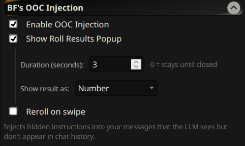
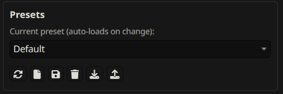
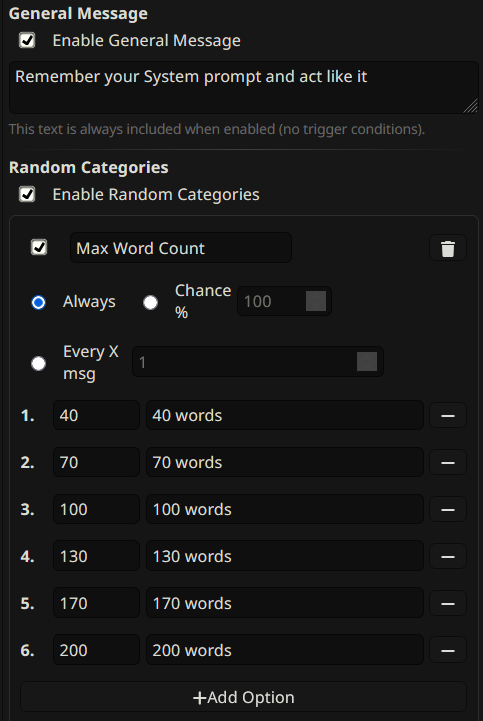

# BF's OOC Injection

**Stop repetitive AI responses. Add dynamic randomization to your SillyTavern roleplay.**

[](https://github.com/BF-GitH/bf-ooc-injection/releases)
[](LICENSE)
[](https://github.com/SillyTavern/SillyTavern)



---

## 🎉 What's New in v1.1.0

**Major Feature Update** - This release transforms OOC Injection into a fully-featured narrative steering system:

- **💾 Preset System** - Save, load, and share complete configurations
- **🎨 Custom Formatting** - Full control over output format and labels
- **🎲 Enhanced Categories** - Tag system for cleaner display, tag/number modes
- **🔄 Reload & Export** - Refresh presets instantly, download as JSON files
- **🐛 Fixed Text Completion** - Now works with KoboldAI, AI Horde, llama.cpp, etc.
- **✨ Better Defaults** - Works perfectly out of the box for new users

[See detailed changelog](#detailed-changelog) | [View all features](#features)

---

## The Problem

LLMs fall into predictable patterns:
- **Repetitive dialogue** - Same phrases, same response structures
- **Stale narratives** - Predictable plot progression, boring pacing
- **Fixed tone** - Characters lose variety and dynamism
- **Manual intervention required** - Constantly editing prompts gets tedious

Traditional solutions have limitations:
- **Author's Note** breaks Claude's Prompt Caching (costs more, runs slower)
- **Manual prompting** requires constant user input
- **Static instructions** don't add variety over time

---

## The Solution

**BF's OOC Injection** automatically randomizes narrative elements in the background, making your stories more dynamic and unpredictable.

### How It Works

Every message, the extension secretly injects randomized instructions that:
- **Vary response length** - Between 40-200 words automatically
- **Change plot direction** - Add twists, complications, or pace shifts
- **Shift character behavior** - Emotional, playful, suspicious, vulnerable
- **Adjust scene focus** - Dialogue, actions, thoughts, or environment
- **Alter tone & mood** - From lighthearted to dramatic to mysterious

**The magic?** These instructions are:
- ✅ **Hidden from chat history** - No token bloat, no permanent clutter
- ✅ **Compatible with Claude Caching** - Unlike Author's Note
- ✅ **Fully automatic** - Set it once, forget it
- ✅ **Completely customizable** - Create your own categories

---

## Features

### 📋 Preset System



Save complete configurations and switch between them instantly:
- **Create & Save** - Multiple presets for different roleplay styles
- **Reload** - Refresh settings without page reload
- **Export/Import** - Share presets as JSON files
- **Protected Default** - Always have a fallback preset

### 🎲 Random Categories



Each message picks one random option from each enabled category:

**Default Categories:**
- **Max Word Count** - 40, 70, 100, 130, 170, 200 words
- **Plot Direction** - Twists, complications, pace changes
- **Character Behavior** - Emotional, logical, vulnerable, defensive, playful
- **Scene Focus** - Dialogue, thoughts, actions, environment
- **Tone & Mood** - Lighthearted, dramatic, intimate, mysterious

**Create Custom Categories** - Add your own with unlimited options!

### 🎯 System Prompt Reinjection

System prompts lose relevance as chat context grows. This feature re-injects them into recent messages:
- **Select which prompts** to reinject from checkboxes
- **Trigger modes** - Always, by chance %, or every X messages
- **Clean history** - Not saved permanently, only sent with current message

### 📌 General Message

Add a static instruction that appears on every message:
- Example: "Remember your System prompt and act like it"
- Perfect for reinforcing important instructions

### ⚙️ Custom Formatting

Complete control over output format:
- Customize all labels and wrappers
- Choose injection position (before/after user message)
- Add prefix/suffix markers
- Template-based category format

### 🎪 Roll Results Popup


See what was randomly selected:
- **Duration control** - Set seconds or "stays until closed"
- **Display modes** - Show as numbers (1/6) or tags (40)
- **Reroll on swipe** - Generate new rolls when regenerating messages

---

## Quick Start

### Installation

**Easy Method (Recommended):**
1. Open SillyTavern
2. Go to **Extensions** → **Install Extension**
3. Paste this URL: `https://github.com/BF-GitH/bf-ooc-injection`
4. Click **Install**
5. ✅ Done! Extension is enabled and configured by default

**Manual Method:**
1. Download and extract this repository
2. Place `bf-ooc-injection` folder in: `SillyTavern/public/scripts/extensions/third-party/`
3. Restart SillyTavern
4. Enable in Extensions settings

### Basic Usage

**The extension works out of the box!** Here's what's enabled by default:

1. **System Prompt Reinjection** - Keeps your system prompts relevant
2. **General Message** - Reminds AI to follow its system prompt
3. **5 Random Categories** - Automatic variety in every response
4. **Roll Results Popup** - See what was selected each message

**Want to customize?** Open the extension settings and:
- Adjust which categories are enabled
- Change trigger modes (always/chance/interval)
- Create custom categories
- Modify formatting and labels
- Save as presets for different scenarios

---

## Use Cases

### Breaking Repetitive Dialogue
Enable **Character Behavior** category to randomly shift emotional states and prevent the same response patterns.

### Dynamic Plot Progression
Use **Plot Direction** to automatically add twists, complications, or pace changes without manual prompting.

### Varied Response Lengths
**Max Word Count** prevents AI from always writing the same length responses, adding natural variation.

### Tone & Atmosphere Shifts
**Tone & Mood** category creates dynamic emotional atmosphere changes throughout your story.

### Multi-Style Roleplays
Create different **presets** for different scenarios:
- "Action RP" - Fast pace, physical focus, energetic
- "Slice of Life" - Balanced focus, calm mood, dialogue-heavy
- "Mystery RP" - Mysterious tone, complications, slower reveals

---

## Configuration Guide

### Creating Custom Categories

1. Click **"Add Category"** in the Random Categories section
2. Name your category (e.g., "Weather", "NPC Attitude")
3. Choose trigger mode (Always/Chance %/Every X msg)
4. Add options with:
   - **Tag** - Short label (e.g., "Sunny", "Hostile")
   - **Text** - Full instruction (e.g., "The weather is sunny and bright", "NPC is hostile and aggressive")
5. Save and enjoy!

### Trigger Modes Explained

- **Always** - Triggers every single message (recommended for most categories)
- **Chance %** - Random probability (e.g., 50% = triggers half the time)
- **Every X msg** - Interval-based (e.g., every 3 messages)

### System Prompt Selection

1. Enable **System Prompt** section
2. Click **"Refresh List"** to load available prompts
3. Check boxes next to prompts you want to reinject
4. They'll be included in the injection automatically

### Preset Management

**Save a preset:**
1. Configure your settings
2. Click **💾 Save As**
3. Enter a name
4. Click **Save**

**Load a preset:**
- Select from dropdown (auto-loads instantly)

**Share a preset:**
1. Click **📥 Export** (downloads JSON file)
2. Share the file
3. Others click **📤 Import** and paste JSON

---

## Comparison: OOC Injection vs. Other Methods

| Feature | OOC Injection | Author's Note | Manual Prompting |
|---------|---------------|---------------|------------------|
| **Claude Caching Compatible** | ✅ Yes | ❌ No | ✅ Yes |
| **Automatic Randomization** | ✅ Yes | ❌ No | ❌ No |
| **Saved to History** | ✅ No (clean) | ✅ Yes (bloat) | ✅ Yes |
| **Manual Effort** | ✅ None | ⚠️ Setup only | ❌ Every message |
| **Dynamic Variety** | ✅ Every message | ❌ Static | ⚠️ If you remember |

**TL;DR:** OOC Injection gives you the automation of Author's Note with the cache-friendliness of manual prompting, plus automatic randomization.

---

## Technical Details

### Injection Point
Last user message during `CHAT_COMPLETION_PROMPT_READY` event (chat completion APIs) or `GENERATE_AFTER_DATA` event (text completion APIs).

### API Compatibility
- **Chat Completion:** OpenAI, Claude (Anthropic), OpenRouter, etc.
- **Text Completion:** KoboldAI, AI Horde, llama.cpp, Ooba, Tabby, etc.

### Chat History
Injected content is NOT saved to chat history - only sent with the current request. This prevents token bloat and keeps your chat clean.

### Caching Behavior
Generated once per message and cached for consistency. Reroll on swipe regenerates for new attempts.

---

## Support the Project

If you find this extension helpful and want to support continued development, consider buying me a coffee! ☕

[](https://ko-fi.com/bf_gith)

Your support helps keep this project maintained and enables me to create more useful tools for the SillyTavern community. Every contribution is greatly appreciated!

---

## Detailed Changelog

### Version 1.1.0 - Major Feature Update

#### 🎉 New Features

**💾 Preset System**
- Save and load complete configurations
- Create fresh presets (clears all settings for clean start)
- Delete unwanted presets
- Import/Export presets via JSON for easy sharing
- Auto-load when selecting from dropdown
- Protected "Default" preset always available

**🎨 Custom Formatting System**
Complete control over output format:
- Customize main wrapper text (default: "BF OOC Injection:")
- Customize system prompt label (default: "Systemprompt Reinject:")
- Customize additional prompt label (default: "Additional Prompt Injection:")
- Customize general message prefix (default: "General:")
- Category format template with `{category}` and `{option}` placeholders

**🎲 Enhanced Toast/Popup System**
- Duration now in **seconds** (user-friendly, previously milliseconds)
- Set duration to `0` for stays-until-closed behavior
- **Tag System**: Each category option has Tag + Text fields
  - Tag: Short label for display (e.g., "40", "Dramatic")
  - Text: Full description (e.g., "40 words", "Tense and dramatic")
- **Display Modes**:
  - Number: Shows position (e.g., "Max Word Count: 1/6")
  - Tag: Shows tag value (e.g., "Max Word Count: 40")
- **Reroll on Swipe**: Generate new random rolls when regenerating messages without sending new user input

**🏷️ Category Tags**
All default categories now include tags for cleaner popup display:
- Max Word Count: `40`, `70`, `100`, `130`, `170`, `200`
- Plot Direction: `Twist`, `Reject`, `Accept`, `Complicate`, `New`, `Slow`, `Fast`
- Character Behavior: `Emotional`, `Irrational`, `Calm`, `Vulnerable`, `Defensive`, `Playful`, `Suspicious`
- Scene Focus: `Dialogue`, `Thoughts`, `Actions`, `Environment`, `Balanced`, `Sensory`
- Tone & Mood: `Fun`, `Dramatic`, `Intimate`, `Mysterious`, `Melancholic`, `Energetic`, `Peaceful`

#### 🔧 UI/UX Improvements

**Collapsible Sections**
- System Prompt settings hide/show based on enable toggle
- General Message text input hide/show based on enable toggle
- Random Categories content hide/show based on enable toggle
- Toast settings hide/show based on popup toggle (Reroll on Swipe always visible)

**Preset UI Enhancements**
- Icon-only buttons with descriptive tooltips for cleaner interface
  - 🔄 Reload - Refresh current preset settings without page reload
  - 📄 New - Create fresh preset
  - 💾 Save As - Save current settings
  - 🗑️ Delete - Remove preset
  - 📥 Export - Download presets as JSON file
  - 📤 Import - Load presets from clipboard
- Collapsible save box (hidden by default, slides down on "Save As")
- Export now downloads a JSON file instead of copying to clipboard

**Category Editor**
- Dual input fields (Tag + Text) for each option
- Tag field optimized at 80px width
- Visual option numbering for easy reference

#### ⚙️ Better Defaults

**Pre-Configured Default Preset**:
- ✅ System Prompt **enabled** with "Always" trigger mode
- ✅ General Message **enabled** with default text: "Remember your System prompt and act like it"
- ✅ Random Categories **enabled** with all 5 categories active
- ✅ All categories include tags out of the box
- ✅ Formatting labels set to sensible defaults

#### 🐛 Bug Fixes & Polish

- **Fixed text completion support** - Extension now works correctly with KoboldAI, AI Horde, llama.cpp, and other text completion APIs
  - Added proper `dryRun` parameter handling for `GENERATE_AFTER_DATA` event
  - Text completion handler now skips dry runs, preventing double injections
- Full backward compatibility with old string-based category options
- Automatic migration to new tag+text structure
- Proper initialization of all new fields
- Preset system includes all settings (toast, formatting, reroll, etc.)
- Clearer labels throughout ("Display mode" → "Show result as")
- Removed confusing examples from dropdown text
- Removed emoji icons from section headers for cleaner UI
- Added descriptive tooltips for better user guidance
- Reroll on Swipe always visible and works independently of popup display

#### 📦 Technical Changes

**New Settings Fields**:
- `toastDuration`: Duration in milliseconds (displayed as seconds to user)
- `toastDisplayMode`: Display mode for roll results ('number' or 'tag')
- `rerollOnSwipe`: Enable rerolling on message regeneration
- `categoriesEnabled`: Master toggle for random categories
- `currentPreset`: Track active preset name
- `presets`: Object storing all saved presets
- `formatting`: Complete formatting customization object

**Category Option Structure**:
```javascript
// Old format: "40 words"
// New format: { tag: "40", text: "40 words" }
```

**Preset Export Format**:
```json
{
  "version": "1.0",
  "presets": {
    "PresetName": { /* complete settings */ }
  },
  "exportDate": "2025-12-27T..."
}
```

**Event Handler Improvements**:
- Text completion handler now properly receives `(data, dryRun)` parameters
- Added dry run detection to prevent injecting during test runs
- Fixed double injection issues with text completion APIs

---

## Contributing

Found a bug or have a feature request? Please open an issue on GitHub!

Pull requests are welcome. For major changes, please open an issue first to discuss what you would like to change.

---

## License

MIT License - See [LICENSE](LICENSE) file for details

---

## Version

**1.1.0**

---

**Made with ❤️ for the SillyTavern community**
